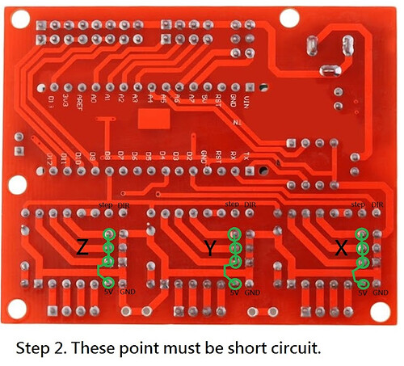

# plotterVS
This repository documents Pen plotter desing and usage.

## Background

I´ve been using DIY pen plotters for a while, 3d printed mostly, they were a lot of fun, but those lack of being reliable. This model it's my 2nd iteration trying to solve that issue and wanting to get a good quality final product, based on my particular needs and understanding of the "best" desing that fits the purpose but keeping the costs as low as possible. 

## How to - BASICS

You will convert a vector ( .SVG ) file to something the plotter can understand, a set of instructions listed in an .Gcode file.

`SVG >>> GCODE`

With a tool like: [SVG2GCODE](https://sameer.github.io/svg2gcode/), you can parse svg files to gcode.     
[Settings JSON file](./Plotter/clean/svg2gcode/svg2gcode_settings.json)   

See below fot templates.(SVG Templates)

Once the gcode file is ready you will send it to plotter. I won't go deeper in this subject.    
Plug >> Connect >> send the file and start it. Check each program docs for details.

Control software examples:
+ Universal Gcode Sender. [UGS](https://winder.github.io/ugs_website/) 
+ CNCJS [cncjs](https://cnc.js.org/)
+ GRBL- Plotter
+ Candle
+ Bcnc

Personally, I've been using the CNCJs over a Raspberry so i don´t need to wire my laptop, it's based on web interface and has proven to be stable and perfectly functional.

## SVG Templates
Some templates can be found in the this [folder](./Plotter/clean/templates).

## Part list for A4 size:
* 2040 vslot: x1 285mm
* 2020 vslot: x2 285mm, .x2 440mm
* Aluminum Corners: x4
* V wheels 22mm: x9 
* Wheel spacers: x6
* Eccentric nuts: x3
* Bolts & T Nuts: At least 12 each
* Gt2 pulleys: 1x 5mm, 2x 8mm
* Gt2 belt. 2 x 500mm, 1 x 600mm
* Gt2 freewheel. 3mm
* 8mm rod, at least 360mm
* Motors Nema 17 x2
* Servo G90
* Aruino Nano & Nanoshield CNC clone with A4988 drivers  (see below)
* Glass: 285 x 440 x 6mm (tempered would be better, but it's expensive, wood can be used too)

Firmware: [GRBL Servo by Misan](https://github.com/misan/grbl-servo) or Robottini's [GRBL Servo](https://github.com/robottini/grbl-servo).

Arduino case: [Link](https://www.thingiverse.com/thing:2379541)

Pen Holder: [Link](https://www.thingiverse.com/thing:3810653/files)

Desing [Freecad Files](./Plotter/2024/2024_complete.FCStd)

## Code Snippets
Code repository for plotting
### Python 
+ Fake cyrcle   
[Circle of Lines](./code/python/fakeCircle/fakeCircle.md).
+ L Systems   
[Lindenmayer Systems](./code/python/lindenmayerSystems/lindenmayerSystems.md)

## JS
+ ARchimendian Spirals    
[Triangle](./code/js/walk/Archimedian_forms/triangle.js)    
[Hexagon](./code/js/walk/Archimedian_forms/hexagon.js)    

### GRBL SERVO SETUP

[Library CODE](https://github.com/robottini/grbl-servo).
  GRBL 0.9i with servo motor support.     
  **Use the PIN D11 to drive the servo.**     
  Use the commands `M03 Sxxx` (xxx between 0 and 255) to rotate the servo between 0-180. The command ``M05`` turn the servo to zero degrees.
  On the current configuration for this build. `M03 S30` is enough for lifting the pen up and clearing the page.
  Commands `M3` and `M5` are valid too.   

| Code     | Action  |
|----------|---------|
| M05      | Pen Down|
| M3 S30   | Pen Up  |

Example configuration can be found on:
[GRBL config](./Plotter/clean/grbl/grbl_config.md)
See below details to map proper pins

### Nanoshield Clone Fixes 
The cheapest controller board on hand was a Keyes Nanoshield clone that supports Arduino nano but it needs some work to work properly.

Soldering required!   
.    
Also before uploading GRBL to the board, the file 'cpu_map_atmega328.p' has to be modified or replaced.   
Grbl patch [here](./Board/Nanoshield_fix/cpu_map_atmega328p.h)    
Full details from [Instructables](https://www.instructables.com/Fix-Cloned-Arduino-NANO-CNC-Shield/)